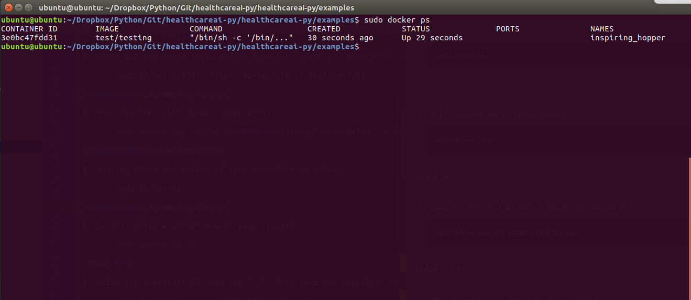

# Making Predictions and Deploying Models

## What do you mean by deploying models?

Essentially pushing predictions to the SQL server.

While there are lots of interesting academic uses of machine learning, the healthcare.ai team believes that in order to improve outcomes, we must bring ML predictions to front line clinicians and the rest of the healthcare team on a timely basis.

To do this you need a robust way to move your ML models into a production setting. These tools make this process easier.

### Database Notes

Most of our current users operate on MSSQL servers. We have therefore spent the most time so far making that pipeline robust.

HealthcareAI can work with other databases such as MySQL and SQLite. You can see examples of their use in [databases](databases.md).

## Am I ready for model deployment?

Only if you've already completed these steps:

- You've created a model that performs well on your data
- You've created the SQL table structure to receive predictions


## Installing docker and a Microsoft SQL server for testing

A Dockerfile, and an entrypoint.sh along with setup.sql are given that sets up a Microsoft SQL (MSSQL) server, and you can follow the deployment.ipynb notebook.

1. If you are new to Docker, you will need to install Docker first:
    
       wget -qO- https://get.docker.com/ | sh

2. Check out the repository, and cd into the `examples` directory, and first build the docker image:
 
       sudo docker build --file=./Dockerfile -t test/testing .


3. Then run the built docker image with: 

       sudo docker run -e 'SA_PASSWORD=yourStrongPassword1234' -p 1433:1433 --net="host" -d test/testing


4. You can check the status of your container by using:
 
       sudo docker ps
       

    
5. Or for containers that are already stopped.

       sudo docker ps -a 


5. Using the container ID, you can `ssh` into into the container by:

       sudo docker exec -i -t <CONTAINER_ID> bash


6. When you are done, you can kill the docker container:

       sudo docker kill <CONTAINER_ID>


7. You can if the container is still running

       sudo docker ps


8. Then you can clear remove all the docker image and containers. Note this will delete all the docker images and containers that are built on your system.

       sudo docker rm $(sudo docker ps -a -q)
       sudo docker rmi $(sudo docker images -q)
    


9. To have Python work properly with Microsoft SQL Server, you will need to have `pyodbc` pip package installed, and the ODBC itself installed, which can be found at: https://docs.microsoft.com/en-us/sql/connect/odbc/linux-mac/installing-the-microsoft-odbc-driver-for-sql-server

## Database tables

Database: SAM

Database Schema: dbo

### For classification predictions:

Database Table: HCAIPredictionClassificationBASE

```sql
CREATE TABLE [SAM].[dbo].[HCAIPredictionClassificationBASE] (
  [BindingID] [int] , 
  [BindingNM] [varchar] (255), 
  [LastLoadDTS] [datetime2] (7), 
  [PatientEncounterID] [decimal] (38, 0), --< change to your grain col
  [PredictedProbNBR] [decimal] (38, 2),
  [Factor1TXT] [varchar] (255), 
  [Factor2TXT] [varchar] (255), 
  [Factor3TXT] [varchar] (255))
```

### For regression predictions:

Database Table: HCAIPredictionRegressionBASE

```sql
CREATE TABLE [SAM].[dbo].[HCAIPredictionRegressionBASE] (
  [BindingID] [int], 
  [BindingNM] [varchar] (255), 
  [LastLoadDTS] [datetime2] (7), 
  [PatientEncounterID] [decimal] (38, 0), --< change to your grain col
  [PredictedValueNBR] [decimal] (38, 2), 
  [Factor1TXT] [varchar] (255), 
  [Factor2TXT] [varchar] (255), 
  [Factor3TXT] [varchar] (255))
```

## After you are setup

Follow the ipython notebook located in: 